# COVID19-prediction-using-Time-Series

## Plotting Dataset

  

## Plotting Rolling Statistics

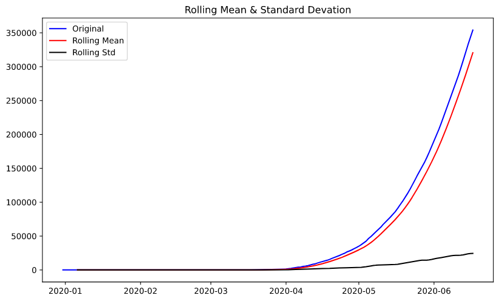  

## Plotting Dataset in Log Scale

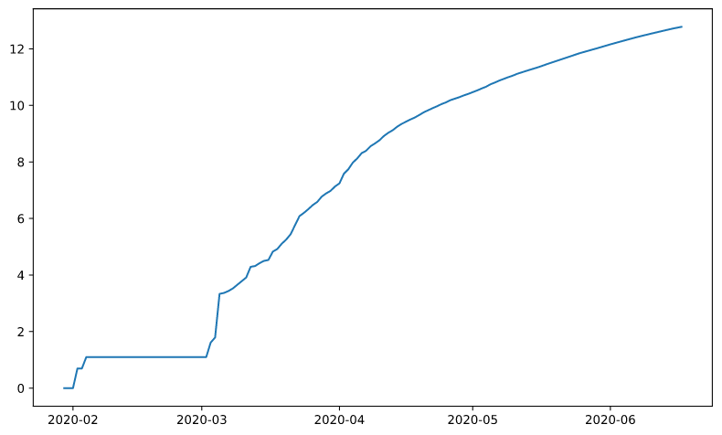

## Plotting Moving Average

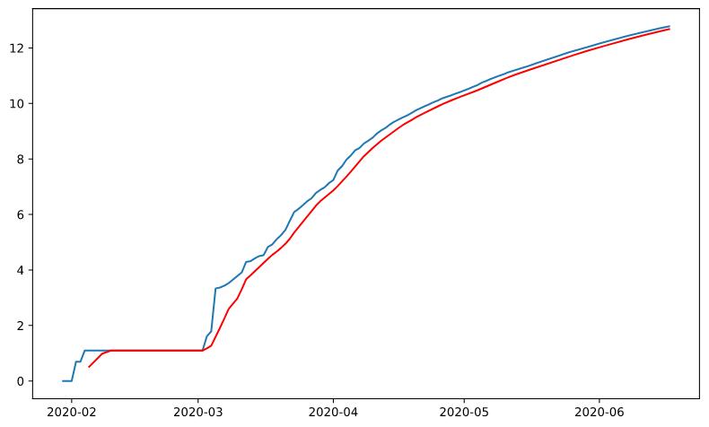  

## Plotting Log Scale minus Moving Avgerage

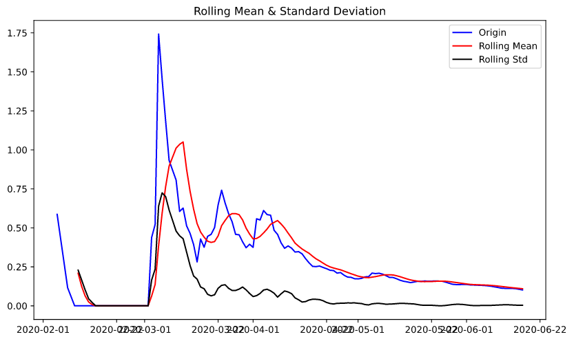  

## Plotting Weighted Average

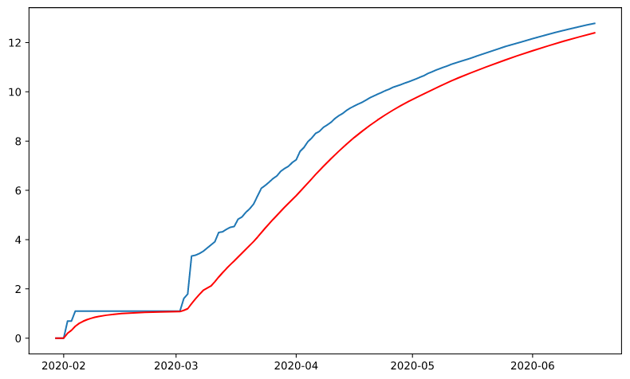  

## Plotting Log Scale minus Moving Exponential Decay Average

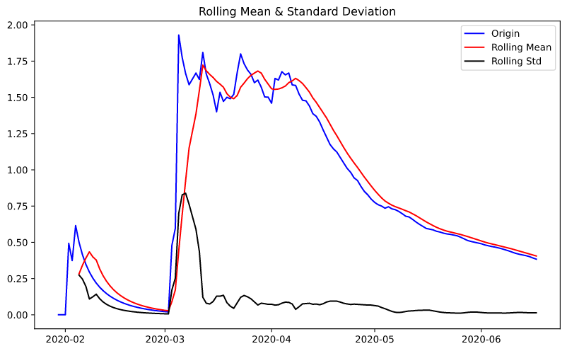  

## Plotting Shifted Log Diffrence

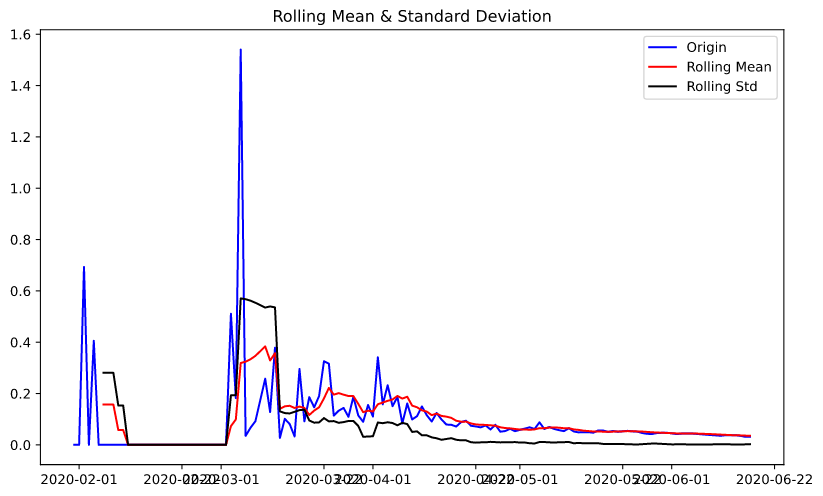  

## Plotting Seasonal Decompostion

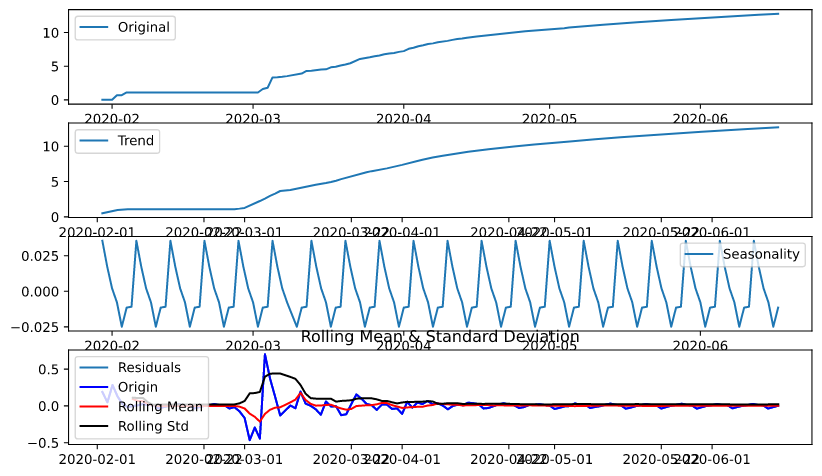  

## Plotting ACF and PACF

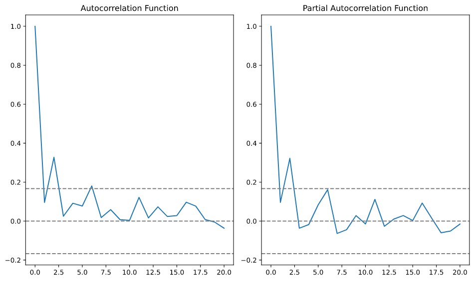  

## Plotting AR Model

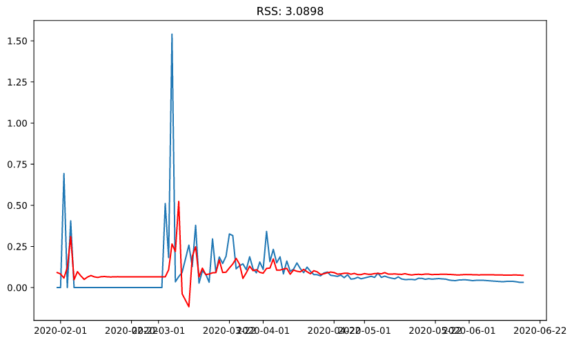 

## Plotting MA Model

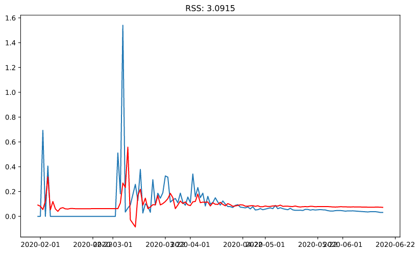 

## Plotting ARIMA Model

 

## Final Predicitions

 
